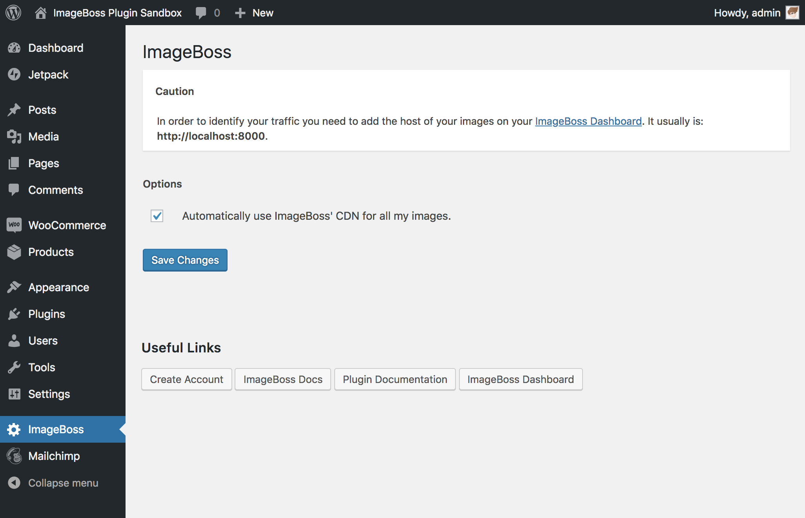
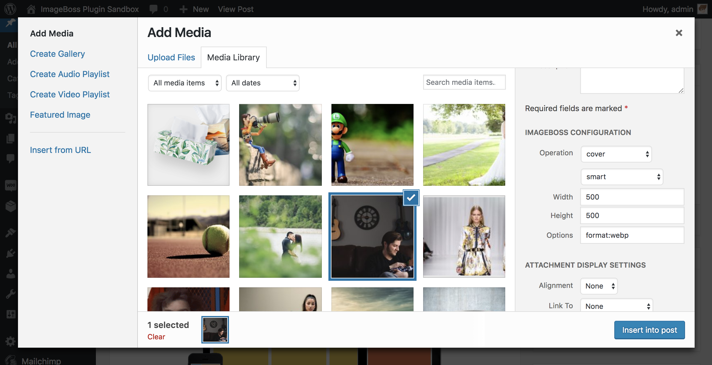

[](https://imageboss.me)

# ImageBoss Plugin for Wordpress

Official Wordpress plugin for ImageBoss.
[https://imageboss.me/](https://imageboss.me/)

# Plugin Features
* WooCommerce Compatible.
* Compression, CDN and progressive scans to all your images AUTOMATICALLY.
* Retina Displays Support.
* Theme Images Supported.
* Post Images Supported.
* Helper for inserting images into your posts using ImageBoss Functionalities.

This plugin allows you to automatically serve all your image files via ImageBoss service which will give you:
* Content Aware Image Cropping.
* Up to 60% smaller images.
* WebP Detection.
* Face Detection.
* Animated GIFs.
* Progressive Scans.
* Image CDN.
* Image Filters.
* Watermarking.

## Manual Installation
Installing "ImageBoss WordPress Plugin" can be done either by searching for "ImageBoss" via the "Plugins > Add New" screen in your WordPress dashboard, or by using the following steps:

1. Download the plugin via httpvs://wordpress.org/plugins/imageboss
2. Upload the ZIP file through the 'Plugins > Add New > Upload' screen in your WordPress dashboard
3. Activate the plugin through the 'Plugins' menu in WordPress

## Features

### Activating CDN features
When you install the plugin this is disable by default. Go to your Dashboard -> ImageBoss -> Settings and activate.

[](https://imageboss.me)

### Adding Images With Custom Configuration
[](https://imageboss.me)

### Using ImageBoss on your Themes & Blog Posts (Using Text Mode)
```html

```
We will render your image according to your params.

### Generating a ImageBoss URL via PHP
#### ibup_mount_imageboss_url($attachment_url, 'cover', 'attention', 500, $height, $options);
```php
echo ibup_mount_imageboss_url($attachment_url, 'cover', 'attention', 500, 500);
```
or

```php
echo ibup_mount_imageboss_url($attachment_url, 'cover', 'attention', 500, 500, 'blur:1');
```

## Tested on
WordPress
  - 4.9.x
